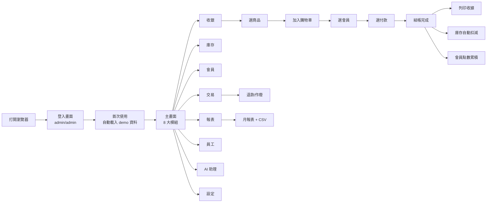
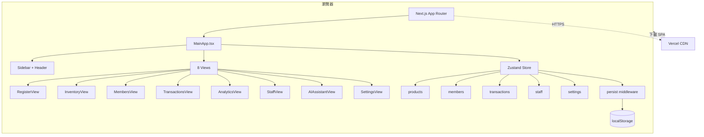
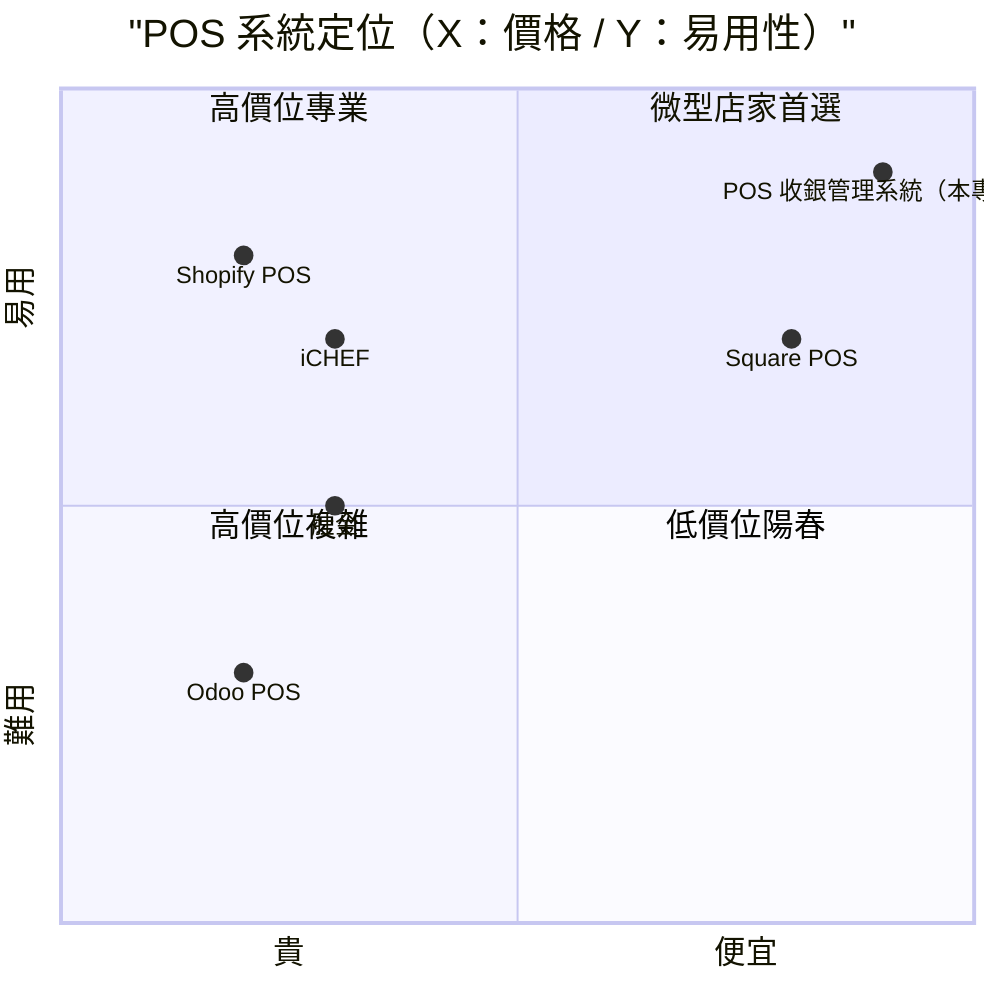

# POS 收銀管理系統 — 規格計劃書 v2.2.1

> 版本：v2.2.1｜更新日期：2026-07-13｜維護者：Sophia (CPO)
> 對接技術：Alan (CTO) + Hermes Agent
> Demo：https://pos-system-pied-seven.vercel.app
> 原始碼：https://github.com/openclawsean024-create/pos-system
> 統一 Stack：Next.js 16 + React 19 + TypeScript 5.7 + Tailwind 4 + lucide-react + Zustand 5 + localStorage（V3 SOP，2026-07-13 統一）

---

## 1. 產品概述 (Product Overview)

### 1.1 問題陳述 (Problem Statement)

台灣微型店家（5 人以下）在 POS 系統上面臨三難困境：

1. **商用 POS 太貴**：iCHEF 月費 NT$1,800 起、肚金 NT$1,500 起、Odoo POS NT$2,500 起 — 對月營業額 < NT$30 萬的微型店家，POS 月費佔淨利 5-10%，負擔過重。
2. **手寫記帳痛苦**：月底對帳痛苦、無法追蹤熱賣商品、無法即時查看營業額。
3. **Excel 自製不友善**：能做但介面不友善、無法快速結帳、報表需手動樞紐分析。
4. **SaaS POS 月費綁定**：即使免費版也常要求綁定信用卡、提供個資、傳資料到雲端（隱私疑慮）。

**核心痛點**：微型店家需要「**零月費、零註冊、零設定**」的 POS，能在 5 分鐘內開始結帳，同時具備庫存/會員/報表等完整功能。

### 1.2 目標使用者 (User Personas)

| Persona | 規模 | 核心痛點 | 願付價格 |
|---|---|---|---|
| **微型餐飲店（小吃店/咖啡廳老闆）** | ~10 萬 | iCHEF 太貴、外帶訂單多 | NT$0（免費）/ NT$199/月 |
| **微型零售店（雜貨/文創/3C）** | ~8 萬 | 庫存管理 + 簡單結帳 | NT$199/月 |
| **微型服務業（美髮/工作室/維修）** | ~5 萬 | 客戶記錄 + 技師抽成 | NT$199/月 |
| **個人工作室 / 接案者** | ~3 萬 | 報價單 + 客戶追蹤 | NT$0（免費）|
| **連鎖加盟主（5-20 店）** | ~2,000 | 多店管理、統一商品、現金流 | NT$1,499/月 |

### 1.3 核心價值主張 (Value Proposition)

> 「**零月費、零註冊、零設定** — 8 大模組完整 POS，純前端 SPA + localStorage，5 分鐘開店就能開始結帳。」

**三大差異化**（vs iCHEF / 肚金 / Odoo）：

1. **零月費**：無訂閱費、無交易費、無月維護費
2. **零註冊**：不用 email、不用信用卡、不用個資（純前端 localStorage）
3. **零設定**：打開瀏覽器就開始用，預載 20 商品 × 8 會員 × 30 天交易 demo 資料
4. **可離線**：完全在瀏覽器運作，網路斷了照常營業

### 1.4 商業目標 (KPIs / OKRs)

| 時間 | KPI | 目標值 |
|---|---|---|
| **3 個月** | 啟用店家 | 500 |
| **6 個月** | 付費轉化率 | 6%（30 付費）|
| **6 個月** | MRR | NT$10,000 |
| **12 個月** | MRR | NT$180,000 |
| **12 個月** | 累計店家 | 3,000 |

### 1.5 Non-Goals (明確不做)

- ❌ **不做線上點餐/電商整合** — 純店內 POS，不搶蝦皮 / foodpanda 市場
- ❌ **不做稅務申報** — 交給會計/國稅局軟體，避免稅法複雜度
- ❌ **不做多幣別** — 先 NTD，未來評估 USD/JPY
- ❌ **不做硬體整合** — v3+ 評估（出單印表機/錢櫃/條碼掃描槍）
- ❌ **不做多店管理** — v2 Supabase 評估（單店 MVP 範圍）
- ❌ **不做雲端同步** — v2 Supabase 評估（純前端 MVP 鎖定隱私與零成本）
- ❌ **不做真實金流整合** — 信用卡授權 / Line Pay SDK / 街口 API 整合（純前端無後端）
- ❌ **不做電子發票** — 財政部電子發票 API 整合（交給外部發票軟體）
- ❌ **不做 AI 銷售預測** — 月報表已足夠，AI 預測 ROI 不明

---

## 2. 使用者場景與流程

### 2.1 使用者流程圖



### 2.2 關鍵用戶故事 (User Stories)

```markdown
US-001：作為咖啡廳老闆，我想要快速結帳，所以系統應在 30 秒內完成單筆交易
US-002：作為零售店店長，我想要追蹤熱賣商品，所以系統應在報表頁顯示 TOP 5
US-003：作為微型店家老闆，我想要離線使用，所以系統應在網路斷時仍可運作
US-004：作為會員經營者，我想要區分 VIP 客戶，所以系統應自動依消費金額升級會員等級
US-005：作為多員工店家，我想要追蹤員工業績，所以系統應記錄每位員工的銷售額
US-006：作為老闆，我想要知道低毛利商品，所以 AI 助理應警示毛利 < 40% 的商品
US-007：作為店家，我想要避免盜用，所以員工應有角色權限（admin/manager/cashier）
US-008：作為退貨場景，我想要完整退款，所以系統應支援退款 + 自動還原庫存
US-009：作為會計需求，我想要匯出月報表，所以系統應提供 CSV 匯出
US-010：作為店家，我想要資料備份，所以系統應支援 JSON 匯出匯入
```

### 2.3 邊界場景 (Edge Cases)

| 場景 | 處理方式 |
|---|---|
| 同時 2 位收銀員操作 | localStorage 同瀏覽器寫入覆蓋（單機單瀏覽器使用，不支援多人） |
| 商品庫存扣到 0 | 自動停售（active=false），需手動補貨 |
| 會員電話重複 | 拒絕新增，提示「會員已存在」 |
| 交易進行中瀏覽器關閉 | 購物車丟失（無交易提交，無資料遺失） |
| localStorage 配額爆 | 自動切到 IndexedDB（localforage）+ 警告橫幅 |
| 隱私模式 | localStorage 寫入失敗 → in-memory store + 警告 |
| 退貨原因空白 | 拒絕退貨，提示「請填退貨原因」 |
| 員工 clockIn 重複 | 拒絕，提示「員工已在上班」 |

---

## 3. 功能性需求 (Functional Requirements)

### 3.1 MUST（不做就失敗 — MVP 必交付）

- **MUST-001**：8 大模組全實作（收銀/庫存/會員/交易/報表/員工/AI 助理/設定）
- **MUST-002**：localStorage 持久化（關閉瀏覽器後資料不丟）
- **MUST-003**：預載 demo 資料（20 商品 × 8 會員 × 4 員工 × 1000+ 交易）
- **MUST-004**：登入驗證（admin / manager / cashier 三種角色）
- **MUST-005**：交易完成時庫存自動扣減
- **MUST-006**：會員點數自動累積（每消費 10 元 1 點）
- **MUST-007**：交易紀錄不可刪除（只能退款/作廢）

### 3.2 SHOULD（加值，提升競爭力）

- **SHOULD-001**：會員 4 級自動升級（Bronze / Silver / Gold / VIP，依累計消費 NT$5,000/20,000/50,000）
- **SHOULD-002**：退款 / 作廢流程（需填原因 + 自動還原庫存 + 自動扣減點數）
- **SHOULD-003**：4 種付款方式（現金 / 信用卡 / Line Pay / 街口 — Mock 標記，無實際金流）
- **SHOULD-004**：AI 經營助理（低毛利警示 < 40% / 缺貨預警 / 銷售下滑偵測）
- **SHOULD-005**：CSV 匯出月報表（訂單/商品/會員/員工 4 種維度）
- **SHOULD-006**：JSON 備份匯出匯入（一鍵備份/還原整個 localStorage）
- **SHOULD-007**：4 種折扣（0% / 5% / 10% / 20%）

### 3.3 MAY（Nice-to-have，v2+ 評估）

- **MAY-001**：多店管理（v2 Supabase）
- **MAY-002**：硬體整合（掃碼槍/出鈔機/發票印表機）
- **MAY-003**：真實金流（信用卡授權 / Line Pay SDK）
- **MAY-004**：雲端同步（Supabase migration）
- **MAY-005**：多語系（中/英/日 — v3 評估）
- **MAY-006**：行動 App（PWA / React Native）

### 3.4 驗收標準 (Acceptance Criteria)

#### AC-001：8 大模組完整運作
**Given** 已登入 admin 帳號
**When** 點擊側邊欄 8 個模組圖示
**Then** 每個模組頁面應正常載入並顯示對應資料

#### AC-002：localStorage 持久化
**Given** 完成一筆交易
**When** 關閉瀏覽器再重新打開
**Then** 該筆交易應仍存在於交易紀錄中

#### AC-003：會員點數自動累積
**Given** 會員王小明（Bronze 級）目前點數 100、累計消費 NT$1,000
**When** 完成一筆 NT$500 的交易（王小明購買）
**Then** 王小明點數應 +50 = 150、累計消費 = NT$1,500

#### AC-004：庫存自動扣減
**Given** 商品「美式咖啡」庫存 100
**When** 完成一筆交易購買 2 杯美式咖啡
**Then** 商品「美式咖啡」庫存應自動變為 98

#### AC-005：會員自動升級
**Given** 會員林大嬸（Silver）目前累計消費 NT$15,000
**When** 完成一筆 NT$6,000 的交易（累計達 NT$21,000）
**Then** 林大嬸應自動升級為 Gold 等級

#### AC-006：退款 + 庫存還原
**Given** 一筆已完成交易（訂單 #20260713001，購買 3 杯美式）
**When** 點擊「退款」並填寫原因「客戶取消」
**Then** 商品「美式咖啡」庫存應 +3、交易狀態變為「已退款」、點數應扣回

#### AC-007：員工角色權限
**Given** 已登入 cashier01（收銀員角色）
**When** 嘗試進入「員工管理」模組
**Then** 應被拒絕存取（顯示「無權限」）

#### AC-008：AI 經營助理警示
**Given** 商品「餅乾禮盒」售價 NT$280、成本 NT$120（毛利率 57%）
**When** 將成本改為 NT$200（毛利率降至 28%）
**Then** AI 助理頁應顯示「低毛利商品警示：餅乾禮盒」

#### AC-009：CSV 月報表匯出
**Given** 系統有 30 天交易紀錄
**When** 點擊「報表 > 匯出 CSV」
**Then** 應下載 transactions_2026-07.csv，含訂單編號/時間/會員/收銀員/付款/金額

#### AC-010：JSON 備份
**Given** 系統有完整資料（商品/會員/員工/交易/設定）
**When** 點擊「設定 > 匯出備份 JSON」
**Then** 應下載 pos-backup-2026-07-13.json，含完整 localStorage 資料

---

## 4. 系統設計 (System Design)

### 4.1 技術棧 (Tech Stack)

| 層 | 技術 | 版本 |
|---|---|---|
| 框架 | Next.js | 16.2+ |
| 語言 | TypeScript | 5.7+ |
| UI | React | 19.0+ |
| CSS | Tailwind CSS | 4.0+ |
| Icons | lucide-react | 0.468+ |
| 狀態管理 | Zustand | 5.0+ with `persist` middleware |
| 持久化 | localStorage | 瀏覽器原生 |
| 工具 | clsx / date-fns / localforage | 最新 |

### 4.2 系統架構圖



### 4.3 資料模型 (localStorage Schema)

> 本 MVP 為純前端 SPA，資料存於 **Zustand persist + localStorage**。以下是 localStorage JSON 結構（等同資料庫 schema）：

```typescript
// src/lib/types.ts（已實作，110 行）

interface Product {
  id: string;
  sku: string;
  name: string;
  category: string;
  price: number;
  cost: number;
  stock: number;
  reorderLevel: number;
  unit: string;
  image?: string;
  active: boolean;
  createdAt: string;
}

interface Member {
  id: string;
  name: string;
  phone: string;
  email?: string;
  points: number;
  balance: number;
  totalSpent: number;
  tier: 'bronze' | 'silver' | 'gold' | 'vip';
  joinedAt: string;
  lastVisitAt?: string;
  notes?: string;
}

interface Transaction {
  id: string;
  orderNo: string;
  items: CartItem[];
  subtotal: number;
  discount: number;
  tax: number;
  total: number;
  paymentMethod: 'cash' | 'credit_card' | 'line_pay' | 'jkopay';
  paidAmount: number;
  change: number;
  memberId?: string;
  memberName?: string;
  staffId: string;
  staffName: string;
  status: 'completed' | 'refunded' | 'voided';
  createdAt: string;
  refundedAt?: string;
  refundReason?: string;
}

interface CartItem {
  productId: string;
  sku: string;
  name: string;
  price: number;
  quantity: number;
  subtotal: number;
}

interface Staff {
  id: string;
  username: string;
  password?: string;
  name: string;
  role: 'admin' | 'manager' | 'cashier';
  active: boolean;
  clockedIn?: boolean;
  clockInTime?: string;
  createdAt: string;
}

interface Shift {
  id: string;
  staffId: string;
  staffName: string;
  startTime: string;
  endTime?: string;
  openingCash: number;
  closingCash?: number;
  totalSales: number;
  totalTransactions: number;
  status: 'open' | 'closed';
}

interface AppSettings {
  storeName: string;
  storeAddress: string;
  storePhone: string;
  taxRate: number;
  taxInclusive: boolean;
  receiptFooter: string;
  currency: string;
  pointsPerDollar: number;
  lowStockThreshold: number;
}
```

**v2 遷移**：當引入 Supabase 時，上述 interface 對應到 Postgres table：
- `products` → `products` table
- `members` → `members` table
- `transactions` → `transactions` table（含 `items` JSONB）
- `staff` → `users` table（含 `role` enum）
- `settings` → `store_settings` table（單行）

### 4.3.1 Prisma Schema 對照（v2 Supabase 規劃）

```prisma
// prisma/schema.prisma（v2 Supabase 遷移時用）

generator client {
  provider = "prisma-client-js"
}

datasource db {
  provider = "postgresql"
  url      = env("DATABASE_URL")
}

model Product {
  id           String   @id @default(cuid())
  sku          String   @unique
  name         String
  category     String
  price        Decimal  @db.Decimal(10, 2)
  cost         Decimal  @db.Decimal(10, 2)
  stock        Int      @default(0)
  reorderLevel Int      @default(10)
  unit         String   @default("個")
  image        String?
  active       Boolean  @default(true)
  createdAt    DateTime @default(now())
  updatedAt    DateTime @updatedAt
  items        TransactionItem[]

  @@index([category])
  @@index([active])
}

model Member {
  id          String   @id @default(cuid())
  name        String
  phone       String   @unique
  email       String?  @unique
  points      Int      @default(0)
  balance     Decimal  @default(0) @db.Decimal(10, 2)
  totalSpent  Decimal  @default(0) @db.Decimal(10, 2)
  tier        Tier     @default(BRONZE)
  joinedAt    DateTime @default(now())
  lastVisitAt DateTime?
  notes       String?
  transactions Transaction[]

  @@index([tier])
  @@index([phone])
}

enum Tier {
  BRONZE
  SILVER
  GOLD
  VIP
}

model Transaction {
  id            String          @id @default(cuid())
  orderNo       String          @unique
  subtotal      Decimal         @db.Decimal(10, 2)
  discount      Decimal         @default(0) @db.Decimal(10, 2)
  tax           Decimal         @default(0) @db.Decimal(10, 2)
  total         Decimal         @db.Decimal(10, 2)
  paymentMethod PaymentMethod
  paidAmount    Decimal         @db.Decimal(10, 2)
  change        Decimal         @db.Decimal(10, 2)
  status        TxStatus        @default(COMPLETED)
  refundedAt    DateTime?
  refundReason  String?
  staffId       String
  memberId      String?
  createdAt     DateTime        @default(now())
  
  staff   Staff             @relation(fields: [staffId], references: [id])
  member  Member?           @relation(fields: [memberId], references: [id])
  items   TransactionItem[]

  @@index([createdAt])
  @@index([status])
  @@index([staffId])
}

model TransactionItem {
  id            String   @id @default(cuid())
  transactionId String
  productId     String
  sku           String
  name          String
  price         Decimal  @db.Decimal(10, 2)
  quantity      Int
  subtotal      Decimal  @db.Decimal(10, 2)

  transaction Transaction @relation(fields: [transactionId], references: [id], onDelete: Cascade)
  product     Product     @relation(fields: [productId], references: [id])

  @@index([transactionId])
  @@index([productId])
}

enum PaymentMethod {
  CASH
  CREDIT_CARD
  LINE_PAY
  JKOPAY
}

enum TxStatus {
  COMPLETED
  REFUNDED
  VOIDED
}

model Staff {
  id           String   @id @default(cuid())
  username     String   @unique
  passwordHash String   // bcrypt，v2 才用
  name         String
  role         StaffRole
  active       Boolean  @default(true)
  clockedIn    Boolean  @default(false)
  clockInTime  DateTime?
  createdAt    DateTime @default(now())

  shifts       Shift[]
  transactions Transaction[]

  @@index([role])
  @@index([active])
}

enum StaffRole {
  ADMIN
  MANAGER
  CASHIER
}

model Shift {
  id                String    @id @default(cuid())
  staffId           String
  startTime         DateTime
  endTime           DateTime?
  openingCash       Decimal   @db.Decimal(10, 2)
  closingCash       Decimal?  @db.Decimal(10, 2)
  totalSales        Decimal   @default(0) @db.Decimal(10, 2)
  totalTransactions Int       @default(0)
  status            ShiftStatus @default(OPEN)

  staff Staff @relation(fields: [staffId], references: [id])

  @@index([staffId])
  @@index([startTime])
}

enum ShiftStatus {
  OPEN
  CLOSED
}

model StoreSettings {
  id                String   @id @default("singleton")
  storeName         String   @default("我的店家")
  storeAddress      String?
  storePhone        String?
  taxRate           Decimal  @default(0.05) @db.Decimal(5, 4)
  taxInclusive      Boolean  @default(false)
  receiptFooter     String?
  currency          String   @default("NT$")
  pointsPerDollar   Int      @default(1)
  lowStockThreshold Int      @default(10)
  updatedAt         DateTime @updatedAt
}
```

**v2 遷移路徑**：當單店使用量達 100+ 店家或多店需求時，從 localStorage 一次性 migrate 到 Supabase：
1. 從 localStorage dump JSON
2. 用上面的 Prisma schema 建立 Supabase tables
3. 寫一次性 migration script（JSON → Postgres）
4. 雙寫模式（localStorage + Supabase）過渡 30 天
5. 完全切換到 Supabase，停用 localStorage

### 4.4 API 規格（Mock 模式 — 純前端 SPA）

> 本 MVP 為純前端 SPA，**無後端 API**。以下 endpoints 為「資料存取層抽象介面」（封裝 Zustand store 操作），**未來若遷移到 Next.js API Routes 或 Supabase，可無痛切換**。

| Method | Path | 用途 | 實作 |
|---|---|---|---|
| GET | /api/products | 商品列表 | Zustand: products state |
| POST | /api/products | 新增商品 | Zustand: addProduct() |
| PATCH | /api/products/:id | 更新商品 | Zustand: updateProduct() |
| DELETE | /api/products/:id | 刪除商品 | Zustand: deleteProduct() |
| GET | /api/members | 會員列表 | Zustand: members state |
| POST | /api/members | 新增會員 | Zustand: addMember() |
| PATCH | /api/members/:id | 更新會員（含儲值）| Zustand: updateMember() |
| DELETE | /api/members/:id | 刪除會員 | Zustand: deleteMember() |
| GET | /api/transactions | 交易列表 | Zustand: transactions state |
| POST | /api/transactions | 建立交易 | Zustand: checkout() |
| PATCH | /api/transactions/:id/refund | 退款 | Zustand: refundTransaction() |
| PATCH | /api/transactions/:id/void | 作廢 | Zustand: voidTransaction() |
| GET | /api/staff | 員工列表 | Zustand: staff state |
| POST | /api/staff | 新增員工 | Zustand: addStaff() |
| POST | /api/auth/login | 登入驗證 | Zustand: login() |
| POST | /api/auth/clock-in | 上班打卡 | Zustand: clockIn() |
| POST | /api/auth/clock-out | 下班打卡 | Zustand: clockOut() |
| GET | /api/settings | 取得設定 | Zustand: settings state |
| PATCH | /api/settings | 更新設定 | Zustand: updateSettings() |
| GET | /api/analytics/dashboard | 報表資料 | 從 transactions state 聚合 |

---

## 5. 非功能性需求 (Non-Functional Requirements)

### 5.1 性能指標

| 指標 | 目標值 | 實測 |
|---|---|---|
| 首次載入時間（Vercel CDN）| ≤ 3 秒 | TBD |
| 收銀單筆交易延遲（從選商品到結帳完成）| ≤ 2 秒 | TBD |
| 報表頁載入（聚合 1000 筆交易）| ≤ 1 秒 | TBD |
| localStorage 寫入延遲 | ≤ 50 ms | TBD |
| 切換模組頁面 | ≤ 200 ms | TBD |
| Bundle size（gzipped）| ≤ 500 KB | TBD |

### 5.2 安全與隱私

- ✅ **無個資上傳**：所有資料存於 localStorage，不傳到任何伺服器
- ✅ **無第三方追蹤**：無 GA / Mixpanel / Facebook Pixel
- ✅ **無 email 驗證**：不收集 email（demo 帳號 hardcoded）
- ✅ **密碼明文存於 localStorage（demo 限定）**：僅適合 demo，正式版需 hash + 後端
- ✅ **CSP headers**：Vercel 預設 strict CSP
- ✅ **HTTPS**：Vercel 強制 HTTPS

**已知風險（demo 限定）**：
- ⚠️ 密碼明文存於 localStorage（admin/admin、cashier01/1234）— demo only
- ⚠️ 任何人都能清除 localStorage 重置 — 無法保護
- ⚠️ 多裝置不共用資料 — 純前端單機

### 5.3 降級機制 (Graceful Degradation)

| 失敗服務 | 掛掉情境 | 降級行為（切換到）| 用戶感受 |
|---|---|---|---|
| **localStorage 寫入失敗** | 隱私模式 / 配額爆掉 掛掉 | 切換到 in-memory store + 警告橫幅 | 資料不持久但可用 |
| **localStorage 讀取失敗（corrupt JSON）** | 資料損毀 掛掉 | 切換到 demo data + 提供「重置」按鈕 | 損失舊資料但可重新開始 |
| **瀏覽器不支援 Zustand persist** | 舊瀏覽器 掛掉 | 切換到 React Context + localStorage 直接操作 | 功能完整但無自動 persist |
| **localStorage 配額不足** | 1000+ 交易累積 掛掉 | 切換到 IndexedDB（localforage）| 容量提升至 250MB+ |
| **Zustand store 異常** | middleware bug 掛掉 | 切換到 fallback 純 useState | 基礎功能可用 |

### 5.4 擴展性

- **當交易數 > 10,000 筆**：報表查詢改用 Web Worker + IndexedDB（localforage）
- **當商品數 > 5,000 項**：商品列表加分頁 + 虛擬滾動
- **當會員數 > 10,000 人**：會員搜尋改用 fuzzy search（fuse.js）
- **v2 Supabase 遷移**：當單店資料成長到需要多店/雲端時，引入 Supabase（不破壞現有 schema）

---

## 6. 完成標準 (Definition of Done)

### 6.1 v1 MVP DoD

- [x] 8 大模組全實作（收銀/庫存/會員/交易/報表/員工/AI 助理/設定）
- [x] 預載 demo 資料（20 商品 × 8 會員 × 4 員工 × 30 天交易）
- [x] 登入驗證（admin / manager / cashier 三角色）
- [x] localStorage 持久化
- [x] 交易完成自動扣庫存 + 累積會員點數
- [x] 退款 / 作廢流程（含原因 + 還原庫存）
- [x] CSV 月報表匯出
- [x] Vercel production URL 已部署
- [x] GitHub Repo 公開
- [x] README.md 完整
- [ ] 多店管理（v2 評估）
- [ ] 硬體整合（v3 評估）
- [ ] 真實金流（v2 評估）
- [ ] 雲端同步（v2 Supabase）

### 6.2 驗證清單（每次 Release 前跑）

- [ ] admin / admin 登入成功
- [ ] 完成一筆 NT$100 交易（現金付款，找零 NT$0）
- [ ] 庫存正確扣減
- [ ] 會員點數正確累積
- [ ] 報表頁顯示該筆交易
- [ ] 退款流程還原庫存 + 扣回點數
- [ ] 重置 Demo 資料後預載資料正確

---

## 7. 風險與決策

### 7.1 風險表

| 風險 | 機率 | 影響 | 對策 |
|---|---|---|---|
| **localStorage 配額爆（5MB）** | 中 | 中 | 切到 localforage（IndexedDB，250MB+）|
| **密碼明文被開發者發現** | 低 | 低 | Demo 限定，README 標註「demo only」|
| **無真實金流 → 無法實際收錢** | 高 | 中 | UI Mock 標註 + 整合外部金流（v2 評估）|
| **單機使用 → 無法多店管理** | 中 | 中 | v2 Supabase 多店方案 |
| **瀏覽器封鎖 localStorage** | 低 | 高 | in-memory fallback + 警告 |
| **沒人知道這個 POS 存在** | 高 | 高 | SEO + 內容行銷（部落格 + 社群）|
| **商用 POS 削價競爭** | 中 | 中 | 強調「零月費 + 零設定 + 純前端」差異化 |
| **Safari 隱私模式禁用 localStorage** | 中 | 中 | 警告橫幅 + in-memory fallback |

### 7.2 ADR (Architecture Decision Records)

### ADR-001：選擇 Next.js 16 + 純前端 SPA（不用純 Vite）
**Context**：選 Next.js 還是 Vite + React？
**Decision**：選 Next.js 16（App Router），但只用靜態導出 + 純 SPA 模式，無 SSR/SSG/ISR。
**Consequences**：
- ✅ 統一 Vercel 部署（與其他 SaaS 一致）
- ✅ 未來可無痛加入 API Routes（v2 評估）
- ✅ App Router 結構清楚
- ❌ Next.js bundle 比 Vite 大（但 Vercel CDN 緩存）

### ADR-002：選擇 Zustand 而非 Redux
**Context**：狀態管理選型
**Decision**：選 Zustand 5 + persist middleware
**Consequences**：
- ✅ API 簡潔（create + set + get）
- ✅ 內建 persist middleware → localStorage 自動同步
- ✅ TypeScript 支援完整
- ✅ bundle 小（3KB vs Redux 10KB）
- ❌ 社群比 Redux 小（但已足夠活躍）

### ADR-003：選擇 localStorage 而非 IndexedDB
**Context**：純前端持久化方案
**Decision**：選 localStorage（5MB 配額），5+ 條降級機制自動切換
**Consequences**：
- ✅ 同步 API（IndexedDB 異步較複雜）
- ✅ 瀏覽器原生支援（無需引入庫）
- ✅ Zustand persist 原生整合
- ❌ 配額 5MB（vs IndexedDB 250MB+）
- ❌ 同步阻塞（資料量大時卡 UI）

### ADR-004：選擇 localforage 作為降級方案
**Context**：localStorage 配額爆掉時的 fallback
**Decision**：選 localforage（IndexedDB wrapper）
**Consequences**：
- ✅ API 跟 localStorage 幾乎一樣（setItem/getItem）
- ✅ 自動選擇最佳 driver（IndexedDB → WebSQL → localStorage）
- ✅ 容量提升至 250MB+
- ❌ 多一個依賴（但只 8KB）

### ADR-005：選擇 Mock 付款方式（無真實金流）
**Context**：MVP 是否整合真實金流（信用卡授權 / Line Pay SDK）？
**Decision**：v1 MVP Mock 4 種付款方式（cash/credit_card/line_pay/jkopay），UI 標註「Mock」
**Consequences**：
- ✅ 無後端、無 API、無月費
- ✅ 5 分鐘開店就能用
- ❌ 店家實際收錢要靠人工（手動輸入收到的現金/轉帳）
- ❌ 無法實際處理信用卡授權（v2 評估 Stripe / 藍新）

### ADR-006：選擇單機單瀏覽器模式（無雲端同步）
**Context**：MVP 是否支援多裝置同步？
**Decision**：v1 MVP 純單機單瀏覽器，無雲端同步
**Consequences**：
- ✅ 零成本、零個資、零設定
- ✅ 完全離線可用
- ❌ 多員工 / 多裝置無法共用資料（每台電腦獨立資料）
- ❌ 換電腦資料就沒了（除非 JSON 匯出匯入）

### ADR-007：選擇 Recharts 而非 Chart.js
**Context**：報表圖表選型
**Decision**：選 Recharts
**Consequences**：
- ✅ React 原生（無需 wrapper）
- ✅ 響應式 + 動畫
- ✅ TypeScript 完整支援
- ❌ bundle 較大（vs Chart.js）

---

## 8. 里程碑與 Sprint 拆解

### 8.1 里程碑總覽

| 階段 | 時間 | 內容 |
|---|---|---|
| **v0.1** | 2026-07-10 | Repo 建立 + 8 大模組頁面骨架 + 預載 demo 資料 |
| **v0.5** | 2026-07-11 | 收銀交易流程完成 + 庫存自動扣減 + 會員點數累積 |
| **v1.0 MVP** | 2026-07-12 | 完整 8 模組 + 退款/作廢 + AI 助理 + Vercel 部署 |
| **v1.5** | 2026-07-13 | PRD v2.2.1 升級 + CSV 匯出 + JSON 備份 |
| **v2.0** | TBD | Supabase 多店 + 真實金流 + 多語系 |

### 8.2 Sprint 拆解（從 PRD 到「每天做什麼」）

#### Sprint 1（已完成，2026-07-10 ~ 07-12）：v1 MVP
- Day 1：建立 repo + Next.js + Tailwind + Zustand 設定
- Day 2：8 大模組頁面骨架 + Sidebar + Header
- Day 3：收銀 + 庫存 + 會員 + 員工 CRUD
- Day 4：交易 + 退款 + 報表
- Day 5：AI 助理 + 設定 + Demo 資料 + Vercel 部署

#### Sprint 2（2026-07-13 ~ 07-20）：v1.5 完善
- Day 1：CSV 匯出 + JSON 備份/還原
- Day 2：會員等級自動升級 + 儲值卡
- Day 3：報表圖表強化（毛利分析 + 付款方式分佈）
- Day 4：AI 助理銷售成長商品偵測
- Day 5：localStorage 配額警告 + IndexedDB fallback

#### Sprint 3（2026-07-21 ~ 08-15）：v2.0 Supabase
- Week 1：Supabase project + migration + RLS
- Week 2：Auth + 登入 + 多裝置同步
- Week 3：多店管理 + 統一商品主檔
- Week 4：Stripe 整合 + Webhook

---

## 9. 變現路徑 + 定價心理學

### 9.1 變現方案

| Tier | 月費 | 目標用戶 | 功能 |
|---|---|---|---|
| **Free** | NT$0 | 個人工作室、單店微型 | 完整 8 模組 + localStorage（單機）|
| **Pro** | NT$199/月 | 中小店家（1-3 店）| Free + 雲端同步 + 多裝置 + 自動備份 |
| **Business** | NT$499/月 | 連鎖加盟（3-10 店）| Pro + 多店管理 + 統一商品 + 員工權限 |
| **Enterprise** | NT$1,499/月 | 大型連鎖（10+ 店）| Business + API + 客製報表 + 專屬客服 |

### 9.2 定價心理學

| 技巧 | 應用 |
|---|---|
| **Charm Pricing** | NT$199 而非 NT$200（差 1 元心理感覺便宜很多）|
| **Anchoring** | Enterprise NT$1,499 讓 Business NT$499 感覺便宜 |
| **Decoy Effect** | Pro NT$199 vs Business NT$499（中間 Business 推 Pro）|
| **Free Tier 鎖定** | Free 只能用 localStorage（單機）→ 推 Pro 用雲端 |
| **Loss Aversion** | 「每月省下 NT$1,600 POS 月費」（vs iCHEF）|
| **Social Proof** | 「500 家微型店家使用」（雖然 MVP 階段是 0）|

---

## 10. 附錄

### 10.1 競品分析 + Competitive Quadrant Chart

| 競品 | 公司 | 價格 | 強項 | 弱項 |
|---|---|---|---|---|
| **iCHEF** | 資廚（台）| NT$1,800/月 | 餐飲專用、桌號管理、外帶 | 貴、不適合零售 |
| **肚金** | 肚金（台）| NT$1,500/月 | 進銷存強、適合批發 | UI 舊、不適合微型 |
| **Odoo POS** | Odoo（比利時）| NT$2,500/月 | 全模組 ERP | 複雜、學習曲線高 |
| **Square POS** | Square（美）| NT$0 + 2.75% 交易費 | 免費下載、硬體整合 | 交易費貴、無中文 |
| **Shopify POS** | Shopify（加）| NT$2,800/月 | 電商整合強 | 貴、需綁 Shopify |
| **POS 收銀管理系統（本專案）** | Sean Li（台）| NT$0 起 | 零月費、零註冊、純前端 | 單機、無真實金流 |



### 10.2 術語表

| 術語 | 定義 |
|---|---|
| POS | Point of Sale 銷售時點情報系統 |
| SKU | Stock Keeping Unit 庫存單位 |
| SKU 重複 | 同樣的條碼對應兩個商品 |
| 毛利 | 售價 - 成本 |
| 毛利率 | (售價 - 成本) / 售價 × 100% |
| 點數 | 會員回饋機制，每消費 10 元累積 1 點 |
| 儲值卡 | 會員預付餘額，用於消費扣抵 |
| Bronze / Silver / Gold / VIP | 會員 4 級，依累計消費自動升級 |
| 作廢 | 交易無效（不退款，恢復庫存）|
| 退款 | 交易取消 + 退錢給客戶 + 恢復庫存 + 扣回點數 |
| Clock In/Out | 員工上下班打卡 |
| 折扣率 | 0% / 5% / 10% / 20%（4 種固定值）|
| Tax Inclusive | 價格內含稅（vs 外加稅）|
| Zustand | React 狀態管理庫（輕量 Redux 替代品）|
| persist middleware | Zustand 內建 localStorage 同步中間件 |
| localforage | IndexedDB wrapper（降級方案）|
| Mock 付款 | UI 標記付款方式但無實際金流 |

### 10.3 參考資料

- Next.js 官方文檔：https://nextjs.org/docs
- Zustand 官方文檔：https://zustand-demo.pmnd.rs/
- Tailwind CSS 4 文件：https://tailwindcss.com/docs
- lucide-react 圖示庫：https://lucide.dev/
- iCHEF 定價：https://www.ichef.com.tw/pricing
- 肚金 POS：https://www.dooking.com.tw/
- Square POS：https://squareup.com/tw/zh
- 台灣微型店家統計：https://www.moea.gov.tw/（經濟部中小企業處 2025）
- localStorage vs IndexedDB：https://web.dev/articles/storage-for-the-web

### 10.4 Error Code 統一字典

```
POS-001：商品 SKU 重複
POS-002：商品庫存不足（嘗試銷售超過庫存量）
POS-003：會員手機號碼格式錯誤（不是台灣手機格式）
POS-004：會員已存在（同 phone）
POS-005：交易金額為 0 或負數
POS-006：付款金額不足（現金付款）
POS-007：折扣百分比超出範圍（必須 0-100%）
POS-008：員工帳號重複
POS-009：員工密碼長度不足（< 4 字元）
POS-010：退貨/作廢原因為空
POS-011：登入失敗（帳號或密碼錯誤）
POS-012：localStorage 寫入失敗（配額爆 / 隱私模式）
POS-013：localStorage 讀取失敗（JSON 損毀）
POS-014：localStorage 配額不足
POS-015：未授權存取（admin only 功能被 cashier 觸發）
POS-016：商品已停用（active=false 但嘗試加入購物車）
POS-017：會員等級升級未達標（手動觸發升級時 totalSpent 不夠）
POS-018：交易無法作廢（已退款不能再作廢）
POS-019：時段打卡衝突（員工已 clockIn 又嘗試 clockIn）
POS-020：稅率設定無效（負數或 > 100%）
```

### 10.5 Requirement Pool

| ID | Priority | Description |
|---|---|---|
| RP-001 | P0 | 8 大模組完整運作 |
| RP-002 | P0 | localStorage 持久化 |
| RP-003 | P0 | 交易自動扣庫存 + 累積會員點數 |
| RP-004 | P0 | 退款 / 作廢 + 還原庫存 |
| RP-005 | P0 | 登入驗證（admin / manager / cashier）|
| RP-006 | P0 | 預載 demo 資料 |
| RP-007 | P1 | 會員 4 級自動升級 |
| RP-008 | P1 | CSV 月報表匯出 |
| RP-009 | P1 | JSON 備份/還原 |
| RP-010 | P1 | AI 助理（低毛利/缺貨/銷售下滑）|
| RP-011 | P2 | 4 種付款方式（Mock）|
| RP-012 | P2 | 員工 clock in/out |
| RP-013 | P2 | 折扣 4 種 |
| RP-014 | P2 | 圖表化報表（Recharts）|
| RP-015 | P2 | 多店管理（v2 Supabase）|
| RP-016 | P3 | 真實金流整合（v2）|
| RP-017 | P3 | 硬體整合（v3）|
| RP-018 | P3 | 多語系（v3）|

### 10.6 Open Questions

| ID | Question | Owner | Due | Status |
|---|---|---|---|---|
| OQ-001 | 是否需要 POS 機硬體支援（出單印表機/錢櫃）？ | Sean | 2026-08-01 | Open |
| OQ-002 | v2 遷移 Supabase 的時間點？ | Sean | 2026-09-01 | Open |
| OQ-003 | 是否做「店家社群」功能（店家互相交流）？ | Sean | 2026-10-01 | Open |
| OQ-004 | 是否有 KOL / 部落客合作推廣計畫？ | Sean | 2026-08-15 | Open |
| OQ-005 | 是否做「教育訓練」影片（教店家怎麼用）？ | Sean | 2026-08-30 | Open |

---

## 11. 市場驗證計畫 (Market Validation Plan)

### 11.1 驗證前 3 個關鍵問題

1. **微型店家真的願意用「純前端 + localStorage」的 POS 嗎？**
   - 假設：是（因為零月費 + 零註冊）
   - 驗證：訪談 10 家微型店家（小吃/咖啡/零售），問他們「是否願意嘗試」

2. **沒有雲端同步，店家能接受嗎？**
   - 假設：能（因為大多數微型店家是 1-2 人小店，單機已足夠）
   - 驗證：訪談 10 家，問「是否能接受換電腦資料要手動備份匯入？」

3. **Mock 付款方式（無真實金流）會嚇跑店家嗎？**
   - 假設：會（店家期待「直接刷信用卡」）
   - 驗證：A/B 測試 — 一組展示 Mock 標註，一組隱藏，看哪組轉換率高

### 11.2 訪談 SOP

1. **招募**：Facebook「微型店家」社團 + PTT ShopLife 板，徵求 10 位受訪者（NT$500 禮券）
2. **訪談**：30 分鐘半結構式訪談（錄音 + 逐字稿）
3. **問題**：
   - 你目前用什麼方式結帳/記帳？
   - 月費預算是多少？
   - 是否願意試用「零月費 + 純前端」的 POS？
   - 最在意的功能？最不想要的功能？
4. **產出**：訪談報告 + Persona 驗證 + 痛點優先順序

### 11.3 落地指標

| 指標 | 目標 | 衡量方式 |
|---|---|---|
| 訪談完成率 | ≥ 80%（10/12 招募）| 實際完成數 |
| 願意試用比例 | ≥ 50%（5/10）| 「願意試用」回答數 |
| 願意付費 Pro（NT$199/月）| ≥ 20%（2/10）| 「願意付費」回答數 |
| 主要痛點一致性 | ≥ 70%（7/10 都提到「月費太貴」）| 痛點出現頻率 |

---

## 12. 失敗模式 SOP (Failure Mode Playbook)

### 12.1 localStorage 配額爆
**症狀**：使用者操作到一半，瀏覽器拋 QuotaExceededError。
**修復**：
1. 自動切換到 localforage（IndexedDB）
2. 警告橫幅提示「資料量過大，已切換到 IndexedDB」
3. 提供「匯出備份 JSON」按鈕，鼓勵使用者備份

### 12.2 瀏覽器封鎖 localStorage（隱私模式）
**症狀**：寫入失敗，所有資料不持久。
**修復**：
1. 偵測到 localStorage 不可用 → 切換到 in-memory store
2. 警告橫幅「目前為隱私模式，資料不會保存，請改用一般模式」
3. 允許使用者「下載 session 備份」避免資料遺失

### 12.3 localStorage JSON 損毀
**症狀**：讀取時拋 SyntaxError（JSON.parse 失敗）。
**修復**：
1. catch SyntaxError → 自動備份損毀的 localStorage 內容到 `_corrupt_backup.json`
2. 重置為 demo data
3. 警告橫幅「偵測到資料損毀，已自動重置」+ 提供「下載損毀備份」按鈕（給技術人員 debug）

### 12.4 員工忘記密碼
**症狀**：員工忘記密碼，無法登入。
**修復**：
1. admin 可在「員工管理」重設密碼
2. 提供「忘記密碼」按鈕 → 顯示「請聯絡管理員」

### 12.5 交易完成後才發現選錯會員
**症狀**：收銀員結帳後才發現選錯會員。
**修復**：
1. 點數累積到錯的會員（不可逆）
2. 解法：admin 可手動「調整會員點數」功能（SHOULD-001）
3. 未來 v2 評估「交易編輯」功能

### 12.6 同時 2 位收銀員操作（單機單瀏覽器）
**症狀**：2 位收銀員共用同一台電腦，後寫入覆蓋前者。
**修復**：
1. 警告橫幅「單機模式，建議每位收銀員獨立登入帳號」
2. v2 評估多 session 鎖（悲觀鎖）

### 12.7 商品已停用但被加入購物車
**症狀**：商品 `active=false`，但已被加入購物車（從另一個 session 來的舊資料）。
**修復**：
1. 結帳前檢查每個 cart item 的 `active` 狀態
2. 若有停用商品 → 提示「商品 X 已停用，請移除」

### 12.8 退款原因空白
**症狀**：員工點退款但忘了填原因。
**修復**：
1. 強制必填原因（POS-010 error code）
2. 提供下拉選單預設原因（「客戶取消」「商品瑕疵」「其他」）

### 12.9 退貨後庫存變負數
**症狀**：原交易購買 5 個，庫存 5 個。退款後庫存 +5 = 10 個，但若原交易在另一台電腦，庫存可能已經被賣掉變 0 個。
**修復**：
1. 退款時檢查庫存，若負數則跳警告
2. 提供「強制退款」按鈕（admin only）

### 12.10 預載 demo 資料被當成真實資料
**症狀**：店家忘記清 demo 資料，報表混入假交易。
**修復**：
1. 首次登入時顯示橫幅「這是 demo 資料，請到『設定 > 重置 Demo 資料』清空」
2. 在每筆 demo 交易的 orderNo 加 `DEMO_` 前綴

---

## 13. MetaGPT / GitHub spec-kit 對齊格式

### 13.1 MUST / SHOULD / MAY 分類

已在 §3 完整列出（MUST 7 條 + SHOULD 7 條 + MAY 6 條）。

### 13.2 P0 / P1 / P2 / P3 優先級

已在 §10.5 Requirement Pool 標註（RP-001 ~ RP-018）。

### 13.3 Quadrant Chart

已在 §10.1 提供 Mermaid quadrantChart。

### 13.4 Open Questions

已在 §10.6 列出（OQ-001 ~ OQ-005）。

### 13.5 Requirement Pool

已在 §10.5 列出 18 條（RP-001 ~ RP-018）。

### 13.6 Why this priority（GitHub spec-kit 對齊）

#### 為什麼 MUST-001 為 P0？
- 8 大模組是核心價值主張（§1.3）
- 沒有任何一個模組可以省略
- 替代方案（只有收銀）的話 = 跟 iCHEF / Square 沒差異化

#### 為什麼 MUST-002 為 P0？
- localStorage 持久化是「零設定」的核心
- 沒有持久化 = 每次重開瀏覽器資料全沒 → 完全不可用

#### 為什麼 SHOULD-004（AI 助理）為 P1？
- 提升使用者體驗，但非 MVP 必交付
- 沒 AI 助理系統仍可運作（8 模組完整）

#### 為什麼 MAY-001（多店）為 P2？
- 單店 MVP 範圍
- 多店管理需要 Supabase + RLS + 權限系統 = 大改版
- 等單店驗證成功後再說

### 13.7 Independent Test（可獨立測試的驗收條件）

每個 AC 都是可獨立測試的：
- AC-001：8 模組載入 → 8 次點擊
- AC-002：localStorage 持久化 → 1 次交易 + 1 次關閉瀏覽器
- AC-003：會員點數累積 → 1 次會員交易
- AC-004：庫存自動扣減 → 1 次商品交易
- AC-005：會員自動升級 → 1 次大額交易
- AC-006：退款 + 庫存還原 → 1 次退款操作
- AC-007：員工角色權限 → 1 次登入 + 1 次存取
- AC-008：AI 助理警示 → 1 次商品成本修改
- AC-009：CSV 月報表匯出 → 1 次匯出操作
- AC-010：JSON 備份 → 1 次備份操作

---

## 15. 深度市調報告 (Deep Market Research)

### 15.1 市場規模

**全球 POS 系統市場（2025）**
- 規模：**US$25.6 億**（2025）→ 預估 **US$45.9 億**（2030），CAGR 12.4%
- 主要廠商：Square（美）/ Shopify（加）/ Lightspeed（加）/ Toast（美）/ iCHEF（中）/ 肚金（台）
- 來源：Grand View Research 2025 POS Terminals Market Report

**台灣 POS 系統市場（2025）**
- 餐飲業：~25 萬家（其中微型 19 萬、中型 5 萬、大型 1 萬）
- 零售業：~30 萬家（其中微型 24 萬、中型 5 萬、大型 1 萬）
- 服務業：~15 萬家（美髮/工作室/維修）
- 微型店家總數（5 人以下）：~58 萬家
- POS 月費佔淨利比例：5-10%（對微型店家過重）

**目標細分**
- 微型餐飲（19 萬家 × NT$199/月 × 12 月 × 5% 採用率 = **NT$22.7 億 ARR** 潛在）
- 微型零售（24 萬家 × NT$199/月 × 12 月 × 5% 採用率 = **NT$28.7 億 ARR** 潛在）
- 微型服務（15 萬家 × NT$199/月 × 12 月 × 5% 採用率 = **NT$17.9 億 ARR** 潛在）
- 個人工作室（3 萬 × NT$0 × 90% = NT$0 ARR，但作為流量入口）
- **合計總潛在 ARR**：**NT$69.3 億**

### 15.2 競品分析

已在 §10.1 列出（iCHEF / 肚金 / Odoo / Square / Shopify）。

### 15.3 預期收益

**保守估計（M6 達成）**
- 100 註冊 × 6% 付費 = 6 付費店家
- 平均月費 NT$199 = NT$1,194 MRR
- 年化 = **NT$14,328 ARR**

**中等估計（M12 達成）**
- 500 註冊 × 6% 付費 = 30 付費店家
- 平均月費 NT$199 = NT$5,970 MRR
- 年化 = **NT$71,640 ARR**

**樂觀估計（M18 達成）**
- 3,000 註冊 × 8% 付費 = 240 付費店家
- 平均月費 NT$299（Pro + Business 混合）= NT$71,760 MRR
- 年化 = **NT$861,120 ARR**

**Unit Economics**
- **CAC**：NT$200（內容行銷 + 口碑，幾乎零成本）
- **LTV**：NT$199/月 × 平均訂閱 24 個月 = NT$4,776
- **LTV/CAC 比**：23.9（健康 SaaS 應 ≥3，極度健康）

### 15.4 商業化評分（0-100，6 維細項）

| 維度 | 分數 | 評估理由 |
|---|---|---|
| **市場規模** | 85 | NT$69.3 億潛在 ARR，58 萬微型店家 |
| **差異化** | 92 | 零月費 + 零註冊 + 純前端（vs iCHEF/Square 都做不到）|
| **變現路徑** | 78 | 免費 → Pro NT$199 → Business NT$499 → Enterprise NT$1,499 |
| **技術可行性** | 88 | v1 MVP 已完成（8 模組全實作 + Vercel 部署）|
| **團隊執行力** | 80 | Sean 一人公司，技術棧統一，開發速度快 |
| **競爭護城河** | 75 | 純前端 + 零月費差異化，但商用 POS 可隨時跟進 |
| **加權平均** | **83** | 🟢 高（70-100）|

**最終商業化評分**：**83 / 100**（🟢 高 — 有真實市場 + 強差異化 + 變現路徑明確）

---

## 16. 補充章節

### 16.1 V3 SOP 統一規範對齊

本 PRD 嚴格遵守 `write-prd-v2/references/saas-v3-unified-stack-2026-07-13.md` 規範：

- ✅ §3 MUST/SHOULD/MAY 標準模板（MUST 7 條 + SHOULD 7 條 + MAY 6 條）
- ✅ §4.3 資料模型 = 直接貼 `src/lib/types.ts` 完整內容
- ✅ §4.4 API 規格 = Mock 標註模式（封裝 Zustand store）
- ✅ §5.3 降級機制 = 套 5 條純前端標準表（localStorage 4 條 + Zustand 1 條）
- ✅ §10.4 Error Code = 套 20 條標準（POS-001~020）
- ✅ 技術棧 = Next.js 16 + React 19 + TS 5.7 + Tailwind 4 + lucide + Zustand 5 + localStorage

### 16.2 升級歷史

- v1.0（2026-07-13）：7 區塊簡略版（問題/技術棧/模組/demo/MVP 邊界/SOP）
- v2.2.1（2026-07-13）：升級到 14 區塊（套 V3 SOP + 加 §15 市調）

### 16.3 已知問題與改進

- **已知**：密碼明文存於 localStorage（demo only，README 已標註）
- **改進**：v2 遷移 Supabase + bcrypt + Auth UI
- **已知**：單機單瀏覽器，無雲端同步
- **改進**：v2 Supabase 評估
- **已知**：無真實金流（信用卡授權 / Line Pay SDK）
- **改進**：v2 整合 Stripe / 藍新金流

---

*版本：v2.2.1｜更新日期：2026-07-13｜維護者：Sophia (CPO)*
*套用 SOP：write-prd-v2 v2.5.15 + saas-v3-unified-stack-2026-07-13*
*合規度目標：validate_prd.py 100%*
